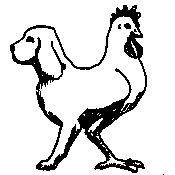

# GDD

## Overview

### Theme

So uhh, first thoughts:

- doogster
- cogk

Ok, so literal interpretation is bad. What about its concept?

- experiment
- mutant
- [twice as many stars as usual][two-headed-calf]

Alright, getting there. Let's go deeper:

- dualism
- ambivalence

Woah, that's too deep. Let's remove the pretentiousness:

- two minds
- two hearts
- two beings

That's it! However, it's still missing something:

- two-beings amalgamate
- two minds connected
- two hearts mingled

Hmm. Should we use one word? This one tickles:

- mingled

This one feels great:

- connected

This one is spooky:

- amalgamate

These three words are great. Let's keep going and decide later.

### Genre

Tough choice. Let's start with what is not going to be:

- platformer
- puzzle
- strategy
- sports
- sandbox
- idle
- simulation
- visual novel

So nothing too common, complex, or that I can't do in an interesting way.
This may be and outlier as well:

- rpg

Nevertheless, I would pick one or two mechanics from it.
Oh, can you guess what I want from this one:

- shooter

Yep, projectiles... Oh, OH! OKAY, I'll stop meandering now,
an idea is taking shape and these two are its outline:

- horror
- adventure

### Setting

This, but without accurate physics simulations:

- [degenerate era][timelapse-of-the-future]

### Concept

This is the idea:

- live the last moments of a civilization as their only source of energy vanishes

### Feel

- gliding, almost ethereal

### Aesthetic

- palette with three colors
- pixel blobs
- dynamic environment

## Gameplay

### Objectives

- prevent the befall of a civilization

### Progression

Through exploration of your surroundings, communicating to other entities and uncovering mysteries, the game moves forward with its narrative.

### Duration

Around 5 minutes, but with replayability.

### Difficulty

Easy, but heightened by its mysteries.

### Loops

#### Primary

Explore your surrondings and interact with its content.

#### Secondary

Encounter entities and communicate with them.

#### Tertiary

Uncover and solve mysteries.

[two-headed-calf]: https://rolfpotts.com/two-headed-calf-by-laura-gilpin/
[timelapse-of-the-future]: https://www.youtube.com/watch?v=uD4izuDMUQA
